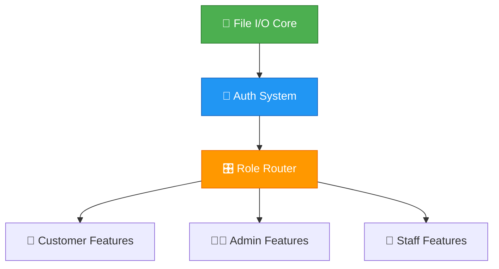

# 🗺️ Phase 2: Unified Team Plan

> **Online Banking System - Group 40**  
> 🎯 Goal: Interactive, file-backed, exception-safe system  
> 📅 Deadline: Week 11, 23:59 | 📊 Weight: 25% of course  
> 🚫 Rule: No AI for code implementation (planning/debugging OK)

---

## 🔄 Critical Path - DO IN THIS ORDER



### Quick Dependency View
```
[1] File I/O (YoussefAdel) - P0 🔴
    │
    ▼
[2] Auth + Login GUI (YousefMohiey) - P0 🔴
    │   Needs: users.txt loader, 3-attempt logic
    ▼
[3] Menu Router (TarekSaeed) - P0 🔴
    │   Needs: authenticated user role
    ├──► [4a] Customer GUI (YosefOsama + YousifHafez) - P1 🟡
    ├──► [4b] Admin Dashboard (AbdelrahmanMazen) - P1 🟡
    └──► [4c] Transaction Logic (TarekSaeed) - P1 🟡
```

---

## 🚨 Phase 1 Feedback → Phase 2 Fixes (Mapped)

| Feedback Item | Fix Required | Owner | Priority | Status |
|--------------|--------------|-------|----------|--------|
| ❌ Hard-coded data | Load from files at runtime | YoussefAdel | 🔴 P0 | ⏳ |
| ❌ Non-interactive menu | while+switch loop with user input | TarekSaeed | 🔴 P0 | ⏳ |
| ❌ Login not implemented | Full auth with role routing | YousefMohiey | 🔴 P0 | ⏳ |
| ❌ Delete user ≠ Delete account | Separate methods for each | AbdelrahmanMazen | 🟡 P1 | ⏳ |
| ❌ Update Staff missing | Search + update phone/password | AbdelrahmanMazen | 🟡 P1 | ⏳ |
| ❌ Manage Account update missing | Profile edit GUI + logic | YosefOsama | 🟡 P1 | ⏳ |
| ❌ Card management missing | Issue/activate/deactivate/stuck | YousifHafez | 🟡 P1 | ⏳ |
| ❌ Pay Bills missing | Credit card/account fee payment | YousifHafez | 🟡 P1 | ⏳ |
| ❌ Too many classes | Merge Deposit/Withdraw into Account methods | TarekSaeed | 🟢 P2 | ⏳ |
| ❌ No custom exceptions | 1 per student, try/catch everywhere | Everyone | 🟢 P2 | ⏳ |

---

## 📊 Phase 2 Grading Rubric (Know What Matters)

```
┌─────────────────────────┬────────┬─────────────────────────────┐
│ Criteria                │ Weight │ Excellence Checklist        │
├─────────────────────────┼────────┼─────────────────────────────┤
│ Files Manipulation      │  30%   │ ✅ CSV format correct       │
│                         │        │ ✅ Read/write no errors     │
│                         │        │ ✅ Data persists restart    │
├─────────────────────────┼────────┼─────────────────────────────┤
│ Exception Handling      │  30%   │ ✅ 1 custom exception/member│
│                         │        │ ✅ try/catch on all risky   │
│                         │        │ ✅ User-friendly error msgs │
├─────────────────────────┼────────┼─────────────────────────────┤
│ Design Enhancements     │  10%   │ ✅ Clean OOP, no bloat      │
│                         │        │ ✅ Collections used right   │
│                         │        │ ✅ Methods not classes      │
├─────────────────────────┼────────┼─────────────────────────────┤
│ Auth & Authorisation    │  10%   │ ✅ 3 failed attempts → exit │
│                         │        │ ✅ Role-based routing       │
│                         │        │ ✅ Logout + stay on login   │
├─────────────────────────┼────────┼─────────────────────────────┤
│ GUI Quality             │  10%   │ ✅ Clean alignment/spacing  │
│                         │        │ ✅ Compatible colors        │
│                         │        │ ✅ Standard Java conventions│
├─────────────────────────┼────────┼─────────────────────────────┤
│ Oral Presentation       │  10%   │ ✅ Clear confident demo     │
│                         │        │ ✅ Answer TA questions      │
│                         │        │ ✅ Explain design choices   │
└─────────────────────────┴────────┴─────────────────────────────┘
```

> 💡 **Math**: If you hit "Good" (80%) on all criteria: 0.8*100 = 80%. Aim for Excellence on Files + Exceptions (60% of grade).

---

## 👥 Team Tasks Summary (Links to Details)

### 🟢 YoussefAdel (258270) — File I/O Core
```
┌─────────────────────────────┐
│ 📁 data/ folder manager     │
│ • CSV parsers for all types │
│ • saveAllData()/loadAllData│
│ • DataLoadException class   │
│ • Auto-create missing files │
└─────────────────────────────┘
         │
         ▼
   [Unblocks EVERYONE]
```
📄 Details: `plan/tasks/YoussefAdel_258270.md`

### 🔵 YousefMohiey (248679) — Auth System
```
┌─────────────────────────────┐
│ 🔐 Login GUI + Logic        │
│ • Username/password check   │
│ • 3-attempt limit → exit()  │
│ • Role-based redirect       │
│ • AuthFailedException       │
└─────────────────────────────┘
         │
         ▼
   [Unblocks Menu Router]
```
📄 Details: `plan/tasks/YousefMohiey_248679.md`

### 🟠 TarekSaeed (252382) — Menu Router + Transactions
```
┌─────────────────────────────┐
│ 🎛️ Main Menu Loop           │
│ • switch+while interactive  │
│ • Refactor Deposit/Withdraw │
│   → methods in Account      │
│ • MenuNavException          │
└─────────────────────────────┘
         │
         ▼
   [Connects Auth → Features]
```
📄 Details: `plan/tasks/TarekSaeed_252382.md`

### 🟣 YousifHafez (258612) — Card + Bills
```
┌─────────────────────────────┐
│ 💳 Card Management          │
│ • Issue/activate/deactivate │
│ • Lost/stuck status flags   │
│ • Pay Bills feature         │
│ • CardStateException        │
└─────────────────────────────┘
```
📄 Details: `plan/tasks/YousifHafez_258612.md`

### 🟡 YosefOsama (255796) — Account GUI + Exceptions
```
┌─────────────────────────────┐
│ 👤 Account Features         │
│ • Update profile GUI        │
│ • Deposit/Withdraw forms    │
│ • Balance validation        │
│ • AccountException          │
└─────────────────────────────┘
```
📄 Details: `plan/tasks/YosefOsama_255796.md`

### 🔴 AbdelrahmanMazen (251979) — Admin Dashboard
```
┌─────────────────────────────────┐
│ 📊 Admin Tools                  │
│ • Staff CRUD (add/update/remove)│
│ • Delete Account (not user)     │
│ • Reports + file export         │
│ • ReportException               │
└─────────────────────────────────┘
```
📄 Details: `plan/tasks/AbdelrahmanMazen_251979.md`

---

## 📦 File I/O Contract (Agree First!)

```
📁 data/
├── users.txt        # CSV: id,username,password,role,active
├── customers.txt    # CSV: id,name,phone,balance,accountNo  
├── staff.txt        # CSV: id,name,phone,jobTitle,salary
├── accounts.txt     # CSV: accNo,customerId,balance,type,active
├── transactions.txt # CSV: txId,fromAcc,toAcc,amount,type,date
├── cards.txt        # CSV: cardNo,customerId,status,limit,expiry
└── reports/         # Generated reports (CSV/PDF)
```

**Rules for everyone:**
- Use `BufferedReader`/`BufferedWriter` with try-with-resources
- Catch `IOException` → throw custom exception → show GUI message
- Never hard-code paths: use `System.getProperty("user.dir") + "/data/"`

---

## 🧪 Testing Protocol (Run This Order)

```bash
# STEP 1: File I/O (YoussefAdel)
✅ App starts → loads users.txt → no crash
✅ Add user via GUI → restart app → user still there

# STEP 2: Auth (YousefMohiey)
✅ Wrong password x3 → app exits cleanly
✅ Correct login → shows correct role menu

# STEP 3: Router (TarekSaeed)  
✅ Customer sees: Deposit/Withdraw/Transfer/Card/Bills
✅ Admin sees: AddStaff/UpdateStaff/Reports/DeleteAccount

# STEP 4: Features (All)
✅ Each action → updates file → restart → data intact
✅ Invalid input → custom exception → friendly error (no stack trace)
✅ Edge cases: empty file, missing file, corrupt CSV → handled gracefully
```

---

## 🤝 Git Workflow + Sync Rules

```bash
# Daily start
git pull origin main --rebase

# Work on your task
git checkout -b feature/yourname-task
# ... code + test ...
git commit -m "feat: your task + exception handled"
git push origin feature/yourname-task

# Open PR
# - Tag 1 teammate as reviewer
# - Wait for ✅ tests + code review
# - Merge to main
```

**Rules:**
- Never push directly to `main`
- Resolve merge conflicts within 1 hour
- All PRs need: code + test + exception coverage
- Discord sync: Post in `#dev-sync` when opening PR

---

## ✅ Done Checklist (Per Student)

```markdown
- [ ] My feature loads/saves to file (zero hard-coded data)
- [ ] My GUI is interactive (switch + while loop, not print statements)
- [ ] I created 1 custom exception + used try/catch on risky ops
- [ ] App survives restart → my data persists 💾
- [ ] Invalid input → friendly error message (no console stack trace)
- [ ] I tested my feature + at least 1 teammate's feature
- [ ] My code follows project structure (no random packages)
```

---

## 🎥 Quick Resources (ADHD-Friendly)

| Topic | Link | Length |
|-------|------|--------|
| Java File I/O | [BufferedReader 5min](https://youtu.be/ue06TSYXJpY) | 5:12 |
| Swing GUI Forms | [JFrame + Inputs](https://youtu.be/58D0Gg9lEYc) | 7:30 |
| Custom Exceptions | [Create + Throw](https://youtu.be/H62VhtM3ZKc) | 3:45 |
| Switch-case Menu | [Interactive Loop](https://youtu.be/example4) | 4:20 |
| Git for Teams | [Branch + PR Flow](https://youtu.be/example5) | 6:15 |

> 💡 Watch at 1.5x speed + code along. Pause > replay > practice.

---

## 🚨 Blockers & Escalation

```
Stuck > 30 min? → 
  1. Check this plan + your task file
  2. Search error in logs/ folder  
  3. Ping Discord: @team + #help + screenshot
  4. If still stuck: tag YoussefAdel for quick sync

Critical bug found? →
  1. Create issue in GitHub/Notes
  2. Tag affected teammate
  3. Propose fix + test before merging
```

---

> 🚀 **Next Step**: Open your task file → create branch → start coding  
> 💬 Remember: Progress > perfection. Ship small, test often, communicate early.  
> 😼 You got this. Top 0.1% engineers are built one commit at a time.

*Last updated: 2026-04-22* | 📍 `plan/GENERAL_PLAN_DEPENDENCIES.md`
